# Omni-Infantry Up-supply

## 框架设计思想

1. ***框架的设计模式***

   框架在结构上分为三层：bsp/module/app。整体使用的设计模式是**结构层级模式**，即每个“类”包含需要使用的底层“类”，通过组装不同的基础模实现更强大的功能。而最顶层的app之间则通过**pub-sub消息机制**进行解耦，使得在编写代码时不会出现相互包含的情况。

2. ***三层结构***

   - **bsp**即板级支持包，提供对开发板外设的软件抽象，让module层能使用和硬件无关的接口（由bsp提供）进行数据处理与交互。

     bsp层和ST的HAL为强耦合，与硬件直接绑定。若要向其他的ST芯片移植，基本不需要修改bsp层；若是其他单片机则建议保留**接口设计**，对接口调用进行重现实现。每一种外设的头文件中都定义了一个**XXXInstance**（xxx为外设名），其中包含了使用该外设所需要的所有数据，如发送/接收的数据，长度，id（如果有），父指针（指向module实例的指针，用于回调）等。由于C没有`class`，因此所有bsp的接口都需要传入一个额外的参数：XXXInstance*，用于实现c++的`this`指针以区分具体是哪一个实例调用了接口。

   - **module**即模块层，包括了需要开发板硬件外设支持的（一般用于通信）真实**硬件模组**如电机、舵机、imu、测距传感器，和通过软件实现的**算法**如PID、滤波器、状态观测器；还有用于兼容不同控制信息模块（遥控器/ps手柄/图传链路/上位机）的统一接口模块，以及为app层提供数据交互的message center。

   - **app**是框架层级中最高的部分。目前的框架设计里，会有多个app任务运行在freertos中，当然你也可以根据需要启动一些事件驱动的任务，所有的任务安排都放在`app/robot_task`中。当前的app层仅是一个机器人开发的示例，有了封装程度极高的module，你可以在app完成任何事情。

---

## 环境配置

### 下载vscode

### 在拓展商店安装插件

#### clangd：

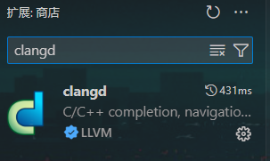

安装后右下角会弹出下载clangd的信息提示，直接install；

#### Embedded IDE（eide）：

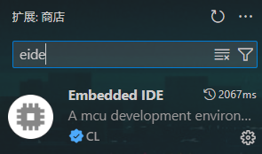

### 安装实用工具

点击侧边栏芯片图标，打开eide界面，点击下方安装实用工具：

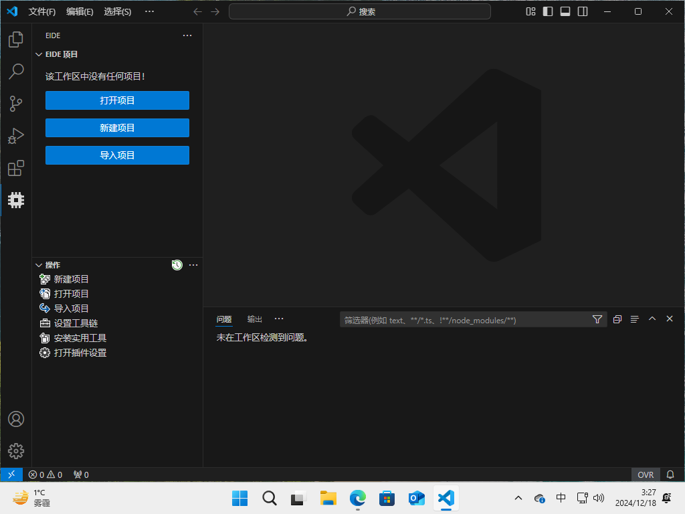

安装**arm gnu toolchain**以及**jlink**驱动：

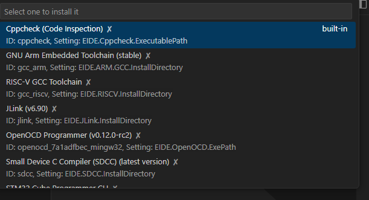

同样会在右下角弹出安装提示，全部安装后工具栏应当如下图所示（可以看到gnu toolchain 和jlink后打了勾）；

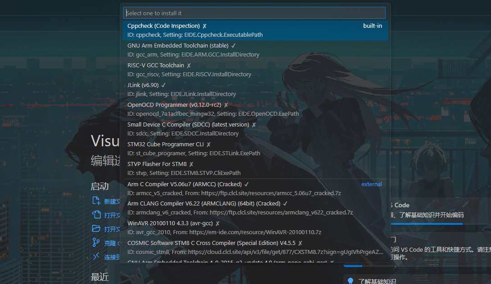

打开toolpack文件夹，点击arm-gnu-toolchain安装程序

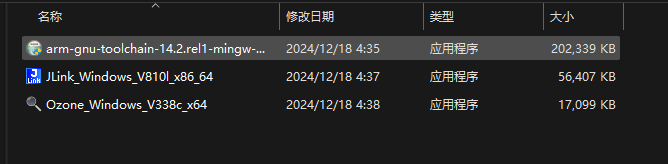

打开安装引导后一路next，但需要复制这里的安装目录：

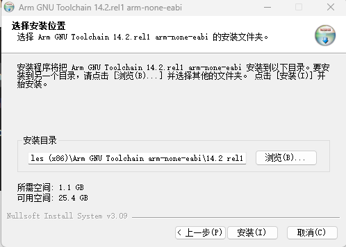

完成安装后回到vscode，打开eide插件设置；

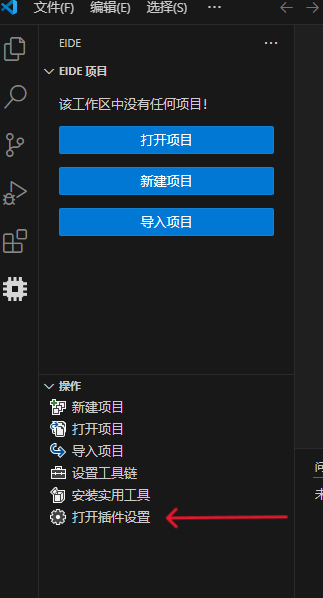

在GCC安装目录下粘贴刚才复制的arm gnu toolchain安装路径；

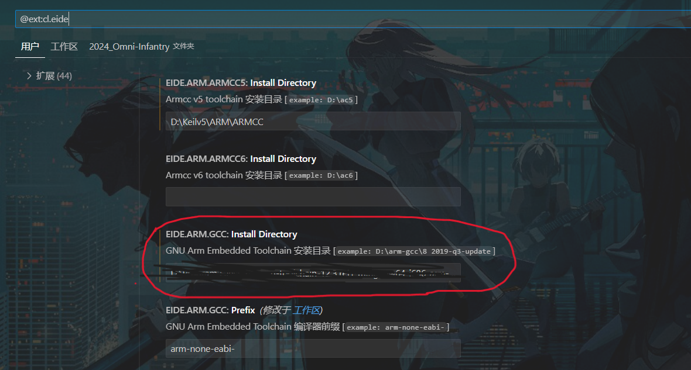

### 打开工程

打开工程文件夹2024_Omni-Infantry，在文件夹中找到basic_framework工作区源文件；

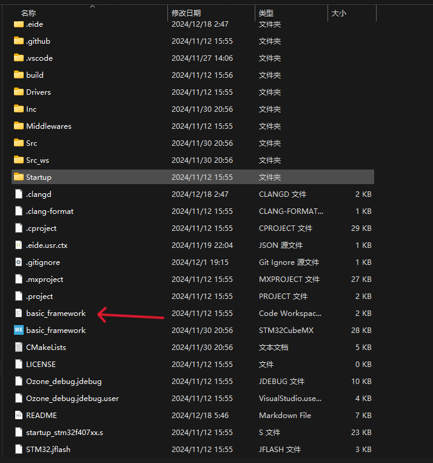

直接双击这个文件，vscode会自动识别这个eide工程，并跳转至工作区；

一切顺利的话现在就可以正常构建代码了。

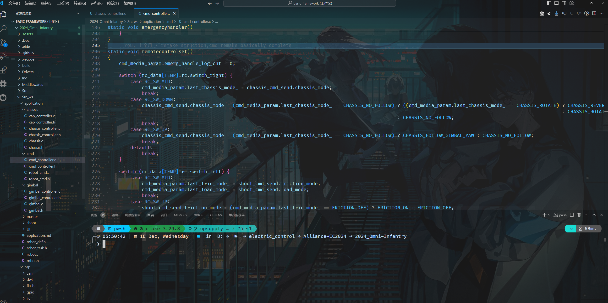

### 构建

可以看到右上角有三个图标（常用），从左到右是构建、清理、烧录。

点击构建后终端会输出编译、汇编以及链接的全部过程，最终会输出单片机可以识别的hex文件以及其他二进制文件。

构建完成：

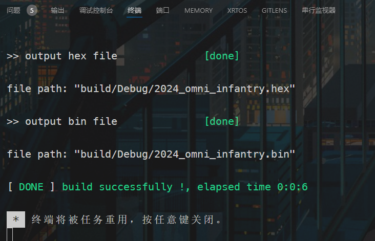

### 下载jlink驱动，ozone调试工具

打开toolpack文件夹，安装剩余两个工具：

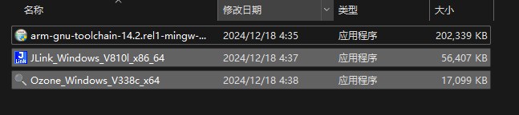

#### jlink

同样需要复制此处的安装目录。

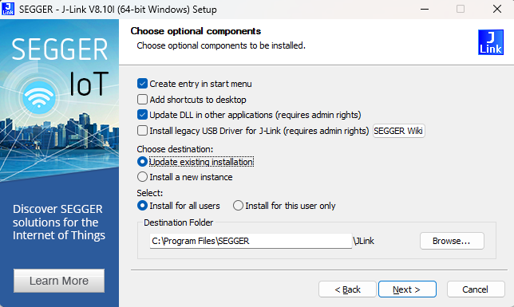

打开vscode，打开eide插件设置，找到jlink安装目录，粘贴复制的路径，在最后添加`\jlink`；

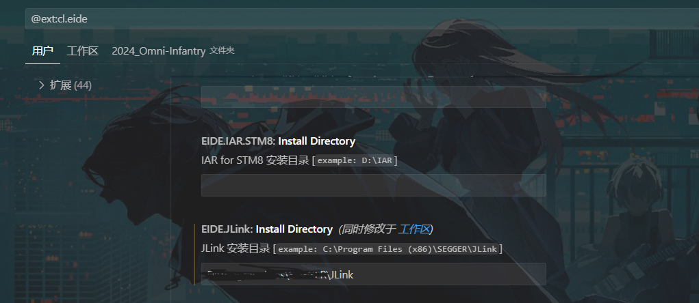

#### ozone

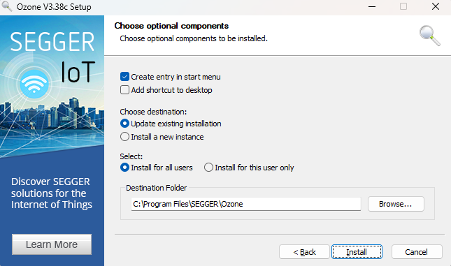

### 烧录

可以直接使用上文提到的eide工具进行烧录，烧录完成后重新给板子上电即可运行代码。

#### ozone调试工具

打开搜索栏搜索ozone并打开；

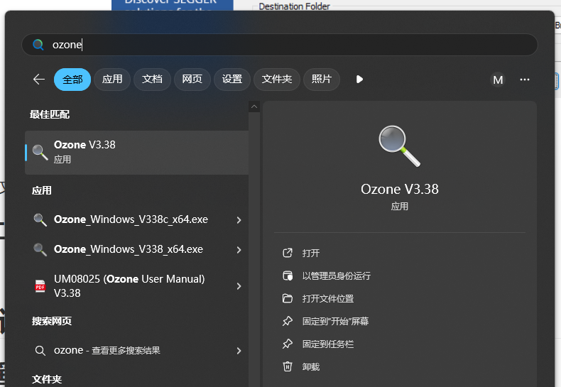

Create New Project；

选择C板对应的芯片STM32F407IG；

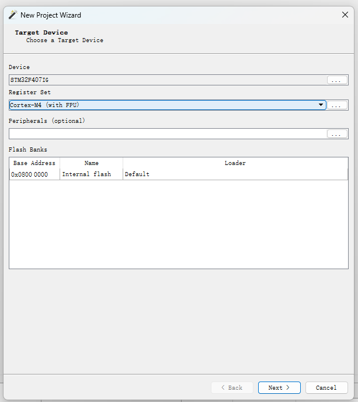

选择swd作为烧录方式；

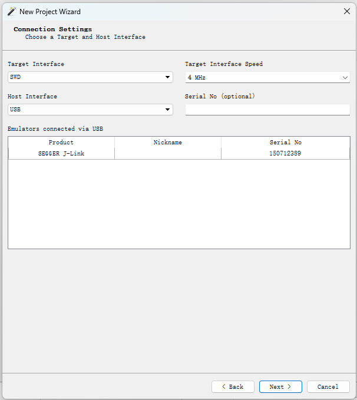

ozone只能打开elf文件，elf文件与hex、bin等二进制文件都是可执行文件，存放在工程目录下build文件下的debug文件夹中。

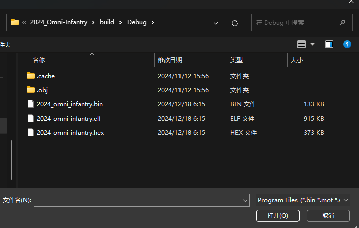

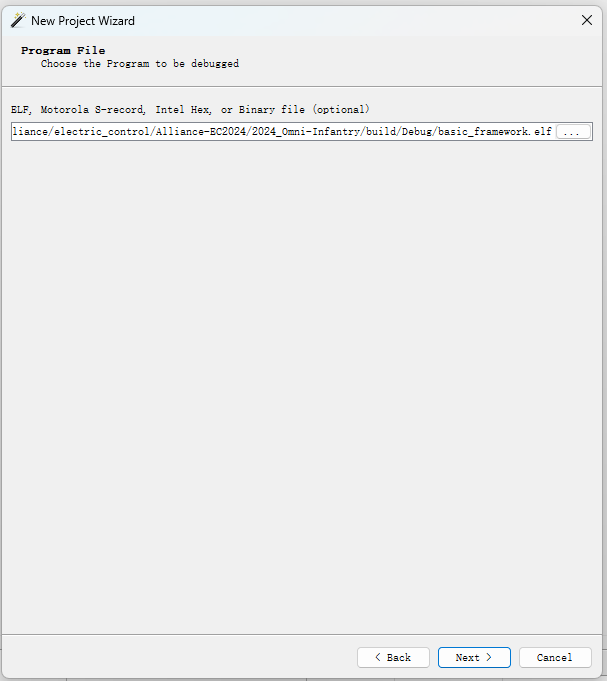

ozone调试画面；

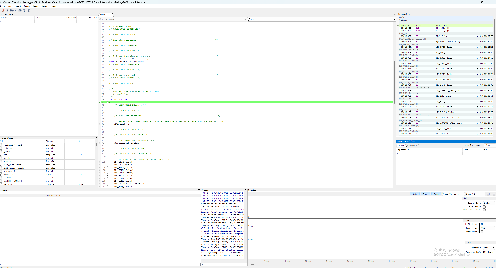

s

## 遥控使用说明

### dt7-dr16遥控系统

#### 拨杆：

- **拨杆双下无力**
- 仅有一侧拨杆拨中时为默认全向移动模式
- 由双下拨至双中后可以模式切换，左拨杆控制发射，右拨杆控制底盘
- 当由双中切换回双下时，先将左侧拨杆拨下更安全

双中状态下：

左：

- 拨杆由中拨上后再拨回中，开启摩擦轮
- 摩擦轮开启状态下重复上述动作关闭摩擦轮
- 摩擦轮开启状态下拨杆由中拨下再拨回中开启拨弹盘，此时为单发模式
- 重复上述动作切换拨弹盘为连发模式
- 连发状态下再重复一次关闭拨弹盘

右：

- 拨杆由中拨至上再拨回中，底盘切换为跟随云台模式
- 重复上述动作关闭此模式
- 拨杆由中拨至下再拨回中，底盘切换至小陀螺模式
- 重复上述动作关闭此模式

#### 拨轮：

向上拨动控制弹仓盖的开关。

#### 摇杆：

左侧控制云台的两自由度运动：水平方向为YAW轴，竖直方向为PITCH轴；

右侧控制底盘平移（以云台方向为正方向）。

### 键鼠控制模式:

**遥控器拨杆左上右下，使用时打开裁判系统选手端，使用micro-usb数据线连接电脑与遥控器，直接将拨杆由双下状态切换至左上右下即可。**

#### 控制方式：

W 前 A 左 S 后 D 右
C 开启/关闭小陀螺
V 开启/关闭摩擦轮
鼠标 控制云台
鼠标左键 连发，ctrl+左键 单发

## 全向轮底盘解算

> 顺时针轮子序号：1，2，3，4 

#### 参数定义

底盘坐标系——底盘自身坐标系

绝对坐标系——机器人运动方向坐标系

$v$——机器人速度矢量

$v_n$——对应轮子的径向速度

$v_x$——底盘坐标系下x轴速度

$v_y$——底盘坐标系下y轴速度

$w_z$——底盘坐标系和绝对坐标系下绕z轴转动

$v_{xcmd}$——cmd输入绝对坐标系下x轴速度

$v_{ycmd}$——cmd输入绝对坐标系下y轴速度

$R$——机器人轴心至轮子距离

$\theta$——底盘坐标系与绝对坐标系的角度误差

坐标系采用右手系：

#### 逆运动学解算

规定当机器人底盘正方向为y轴正方向。即底盘朝向北时，x轴正方向为东。

底盘在绝对坐标系下沿x轴和y轴平动，绕z轴转动

机器人底盘速度矢量沿x和y轴分解：
$$
\vec{v}=\vec{v_x}+\vec{v_y}+\vec{w_z}*R
$$

##### 底盘坐标系与绝对坐标系重合：

$$
v_1=v_x+v_y+w_z*R\\
v_2=v_x+-v_y+w_z*R\\
v_3=-v_x+-v_y+w_z*R\\
v_4=-v_x+v_y+w_z*R\\
$$

##### 底盘坐标系与绝对坐标系存在角度误差：

以逆时针为正方向：
$$
v_x=v_{xcmd}*cos\theta-v_{ycmd}*sin\theta\\
v_y=v_{xcmd}*sin\theta+v_{ycmd}*cos\theta
$$
代入原方程组得四轮速度：
$$
v_1=v_{xcmd}*cos\theta-v_{ycmd}*sin\theta+v_y+w_z*R\\
v_2=v_{xcmd}*cos\theta-v_{ycmd}*sin\theta+-v_y+w_z*R\\
v_3=-v_{xcmd}*cos\theta-v_{ycmd}*sin\theta+-v_y+w_z*R\\
v_4=-v_{xcmd}*cos\theta-v_{ycmd}*sin\theta+v_y+w_z*R\\
$$

## 发射机构
规则限制了发射机构热量，代码中的shoot_controller.c中存在热量控制部分，实现原理为读取摩擦轮转速并做导数处理，比较尖峰来判断是否发弹并记录及本地热量，若热量接近上限则停转拨弹盘，实现本地热量管理。